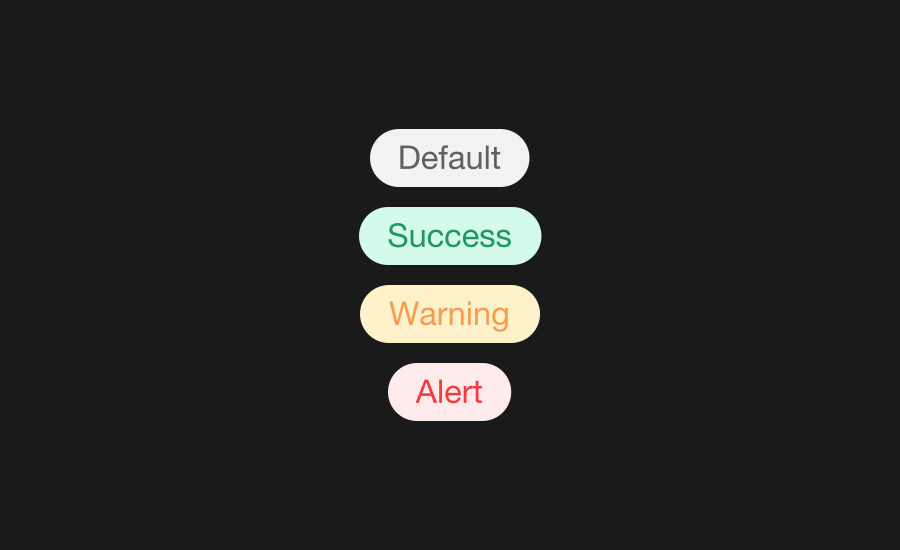

# Бейдж



Блок для маркировки статуса сущности. Например, статус платежа.

```js
{
	block: 'badge',
	mods: { view: 'default' },
	content: 'Badge'
}
```

| Модификатор | Значение                            |
|-------------|-------------------------------------|
| view        | default / success / warning / alert |

## Задание

Расставь `badge` соответственно статусам в строках платежей.

<iframe height='500' scrolling='no' title='badge' src='//codepen.io/whitepapertools/embed/cfc6b56114a7d5664d69c12f693227da/?height=500&theme-id=0&default-tab=js,result&embed-version=2&editable=true' frameborder='no' allowtransparency='true' allowfullscreen='true' style='width: 100%;'>See the Pen <a href='https://codepen.io/whitepapertools/pen/cfc6b56114a7d5664d69c12f693227da/'>badge</a> by whitepaper (<a href='https://codepen.io/whitepapertools'>@whitepapertools</a>) on <a href='https://codepen.io'>CodePen</a>.
</iframe>
