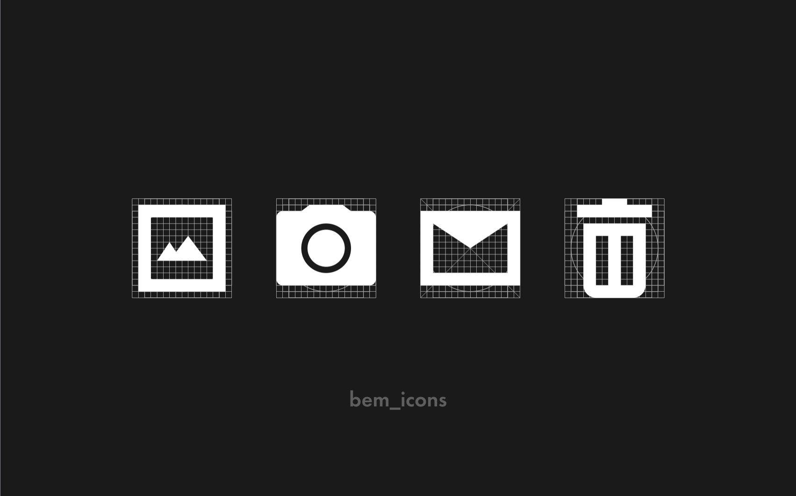

# Иконки

В библиотеке иконки предусмотрены для использования, как самостоятельно в интерфейсе, так и в паре с текстовым блоком. Поэтому все иконки существуют в тех же цветах, что и текст. Визуально модификации текста можно посмотреть в разделе [Типографика](http://whitepaper.tools/icon.html).

Размеров всего два: `s` – 16х16px и `m` – 20x20px.

Чтобы вставить иконку, нужно знать название иконки, размер и необходимый цвет. Иконки вставляются в разметку шаблоном инлайново. Это позволяет перекрашивать их на лету.

<iframe height='250' scrolling='no' title='icon' src='//codepen.io/whitepapertools/embed/4dbf86f3563611eae9a2f6b447e7e818/?height=250&theme-id=0&default-tab=js,result&embed-version=2&editable=true' frameborder='no' allowtransparency='true' allowfullscreen='true' style='width: 100%;'>See the Pen <a href='https://codepen.io/whitepapertools/pen/4dbf86f3563611eae9a2f6b447e7e818/'>icon</a> by whitepaper (<a href='https://codepen.io/whitepapertools'>@whitepapertools</a>) on <a href='https://codepen.io'>CodePen</a>.
</iframe>

| Модификаторы `icon` | Значения                                                          |
|---------------------|-------------------------------------------------------------------|
| size                | s / m                                                             |
| view                | alert / disable / ghost / primary / secondary / success / warning |
| name                | add-1 / add-2 / user / album / allert-2 / anchor / arrow-down / arrow-left-circle / arrow-left / arrow-right-circle / arrow-right / arrow-up / attention-circle / attention / back / blog / bug / cancel / canceled / check-circle / check / cheque-fail / cheque-progress / cheque-success / close-circle / close / comment / connect-circle / crop / devices / double-arrow-down / double-arrow-up / enter / export / fail / fave-1 / filter / front / globe / hamburger / help / list / lock-circle / lock / mail-1 / marker / minus / next / output / part / pause / phone-1 / photo / picture / play / playlist / previous / protect / refresh / repeat-song / repeat / save / search / shuffle / statistic / swap / target / time / track / trash / upload / user / volume / wait-2 / wait |
