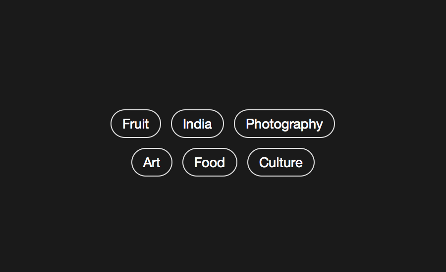

# Тэг



Идентификатор для категоризации, описания, поиска данных и задания внутренней структуры.

```js
{
	block: 'tag',
	mods: { view: 'default' },
	content: [
	{
		elem: 'text',
		content'Design'
	},
	{
		elem: 'delete',
		mix: { block: 'icon', mods: { name: 'delete-2', size: 's', view: 'ghost' } }
	}]
}
```

Тег может быть информационным, а может быть ссылкой. Также тег может быть редактируемым и нет. Если тег можно редактировать, то к нему в контент можно положить контрол, как в примере выше.

| Модификатор | Значение                 |
|-------------|--------------------------|
| view        | default / disable / link |
| size        | m / s                    |

<iframe height='500' scrolling='no' title='tag' src='//codepen.io/whitepapertools/embed/093f2fd999b676a1986b847dc827945d/?height=500&theme-id=0&default-tab=js,result&embed-version=2&editable=true' frameborder='no' allowtransparency='true' allowfullscreen='true' style='width: 100%;'>See the Pen <a href='https://codepen.io/whitepapertools/pen/093f2fd999b676a1986b847dc827945d/'>tag</a> by whitepaper (<a href='https://codepen.io/whitepapertools'>@whitepapertools</a>) on <a href='https://codepen.io'>CodePen</a>.
</iframe>
