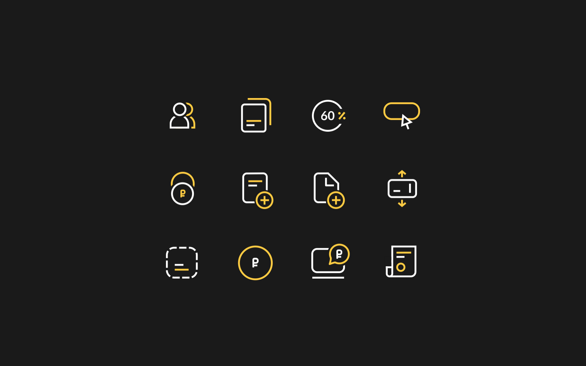
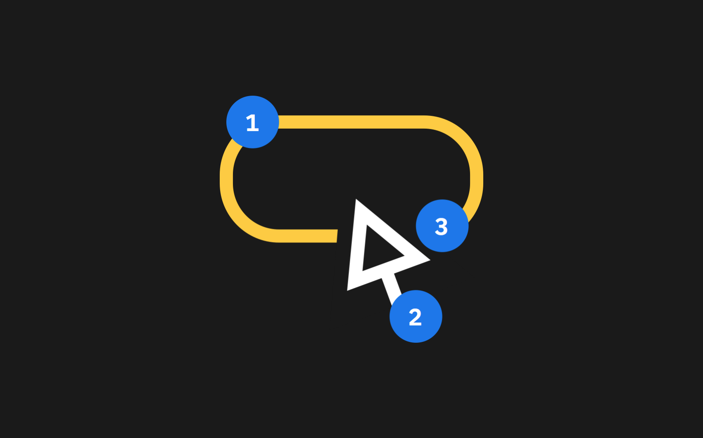

# Векторы

Векторы — крупные маркерные иконки. Они не имеют никакого значения сами по себе, а всего лишь дополнительно поддерживают текст. Например, на промо-страницах.

Состоят векторы из следующих частей:

1. Декоративный строук для привлечения внимания;
1. Базовый строук отвечающий за форму;
1. Пустой слой, который нужен для того, чтобы иконку можно было использовать на различных подложках

Применяются векторы так же, как иконки.

<iframe height='500' scrolling='no' title='vector' src='//codepen.io/whitepapertools/embed/27a671e29b22621062de8e15c85b2566/?height=500&theme-id=0&default-tab=js,result&embed-version=2&editable=true' frameborder='no' allowtransparency='true' allowfullscreen='true' style='width: 100%;'>See the Pen <a href='https://codepen.io/whitepapertools/pen/27a671e29b22621062de8e15c85b2566/'>vector</a> by whitepaper (<a href='https://codepen.io/whitepapertools'>@whitepapertools</a>) on <a href='https://codepen.io'>CodePen</a>.
</iframe>
