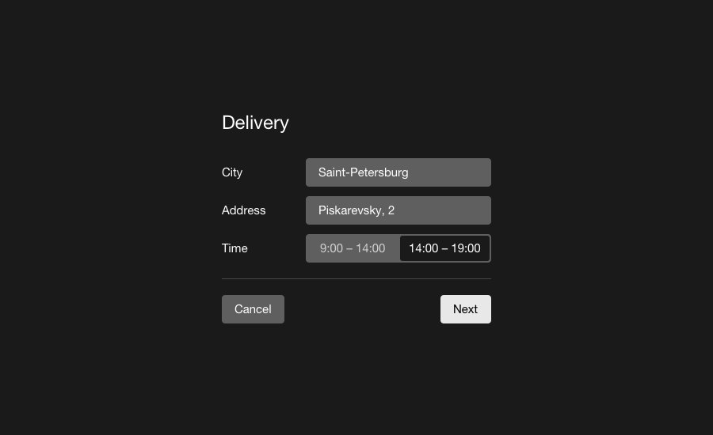

# pt-form



Этот паттерн используется для представления информации, требующей ввода данных или выбора настроек, для дальнейшей отправки.

```js
{
	block: 'pt-form',
	content: [
	{
		elem: 'item'
	},
	{
		elem: 'item'
	},
	{
		elem: 'item'
	}]
}
```

Модификаторы | Значение        | Описание
------------ | --------------- | ------------------
border       | all             | Обводка всей формы
shadow       | cloud           | Тень от формы
view         | default / ghost | Фон

## Элемент item

Каждый логический блок формы – элемент `item`. Их вложенность может быть любой глубины.

<iframe height='500' scrolling='no' title='pt-form' src='//codepen.io/whitepapertools/embed/ff8d206dcb0f5670c6072825ed74968a/?height=500&theme-id=0&default-tab=js,result&embed-version=2&editable=true' frameborder='no' allowtransparency='true' allowfullscreen='true' style='width: 100%;'>See the Pen <a href='https://codepen.io/whitepapertools/pen/ff8d206dcb0f5670c6072825ed74968a/'>pt-form</a> by whitepaper (<a href='https://codepen.io/whitepapertools'>@whitepapertools</a>) on <a href='https://codepen.io'>CodePen</a>.
</iframe>

Модификаторы элемента`item`  | Значение                         | Описание
---------------------------- | -------------------------------- | -------------------------------------
border                       | all / bottom / top               | Обводка
distribute                   | default / between / right        | Распределение контента по горизонтали
vertical-align               | default / center / baseline      | Выравнивание конента по вертикали
indent-a                     | xs / s / m / l / xl / xxl / xxxl | Внешние отступы по всем сторонам
indent-h                     | xs / s / m / l / xl / xxl / xxxl | Внешние отступы по горизонтали
indent-v                     | xs / s / m / l / xl / xxl / xxxl | Внешние отступы по вертикали
indent-t                     | xs / s / m / l / xl / xxl / xxxl | Внешний отступ сверху
indent-r                     | xs / s / m / l / xl / xxl / xxxl | Внешний отступ справа
indent-b                     | xs / s / m / l / xl / xxl / xxxl | Внешний отступ снизу
indent-l                     | xs / s / m / l / xl / xxl / xxxl | Внешний отступ слева
space-a                      | xs / s / m / l / xl / xxl / xxxl | Внутренние отступы по всем сторонам
space-h                      | xs / s / m / l / xl / xxl / xxxl | Внутренние отступы по горизонтали
space-v                      | xs / s / m / l / xl / xxl / xxxl | Внутренние отступы по вертикали
space-t                      | xs / s / m / l / xl / xxl / xxxl | Внутренний отступ сверху
space-r                      | xs / s / m / l / xl / xxl / xxxl | Внутренний отступ справа
space-b                      | xs / s / m / l / xl / xxl / xxxl | Внутренний отступ внизу
space-l                      | xs / s / m / l / xl / xxl / xxxl | Внутренний отступ слева

## Элементы label и controls

Используются в паре, когда лейбл и контрол должны стоять в одну строку. В случае, когда лейбл находится над контролом, обёртки не нужны.

Модификаторы элемента `label` | Значение          | Описание
----------------------------- | ----------------- | ---------------------------------------------
width                         | default / inverse | Ширина элемента 35% / 65% относительно строки
